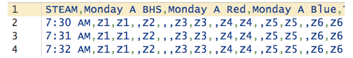
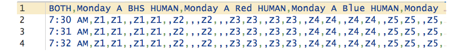

# bhs-calendar

This is a project of the 2018-2019 [Brookline High School](http://bhs.brookline.k12.ma.us/career--technology-education.html) (BHS) [AP Computer Science Principles](https://sites.google.com/psbma.org/david-petty/archive/2018-2019/apcsp) class as a post-examination project completed (mostly) by juniors and sophomores in the class and the class instructor. This effort has been further aided by teachers and administrators interested in developing and using the tool.

## New schedule

For the academic years 2019-2020 and 2020-2021, [BHS](http://bhs.brookline.k12.ma.us/) will be [under construction](http://bhs.brookline.k12.ma.us/expansion-project.html). Consequently, grade-9 students will be organized in two [cohorts](http://bhs.brookline.k12.ma.us/9th-grade-transition.html) with part of each day being at [Old Lincoln School](https://google.com/maps/place/194+Boylston+St.+02445).

## What we did

- We created a minute-by-minute [spreadsheet](https://docs.google.com/spreadsheets/d/1ElzWdWimIW7kABuK7UxARrl-ud2nYNYw5Ur_KMCq4mM/) based on the published BHS schedules [1B](./data/19_20_SCHED_v1B.pdf) &amp; [1B (teacher)](./data/19_20_SCHED_v1bTeacher.pdf) with the following encoding:
  - The top row contains the name of the schedule's lunch in the leftmost column &mdash; the `HUMAN` lunch (currently called *Lunch A*) or the `STEAM` lunch  (currently called *Lunch B*) &mdash; followed by headers for each cohort for each day formatted as either 3 or 4 space-separated values: *day, week, cohort* or *day, week, cohort, lunch* (when more than one lunch is included in the single schedule).
  - The leftmost column contains the name of the schedule's lunch in the top row, followed by the minute-by-minute time from `7:30 AM` to `3:00 PM` inclusive, one minute per row.
  - Blocks `A`, `B`, `C`, `D`, `E`, `F`, `G`, `T` (&amp; `T-H`), `X`, &amp; `Z` are identified with their numbers.
  - Lunches are indicated as `LB` (lunch at BHS) and `LO` (lunch at OLS).
  - Passing time is indicated with a variety of codes: `P` (regular passing time beween classes), `PB2O` (grade-9 passing from BHS to OLS), `PO2B` (grade-9 passing from OLS to BHS), `PS` (passing time before or after a 'split lunch'), and `?` (passing time taken from one block or the other when listed on the [schedule](./data/19_20_SCHED_v1bTeacher.pdf) as zero-length).
- Within the [spreadsheet](https://docs.google.com/spreadsheets/d/1ElzWdWimIW7kABuK7UxARrl-ud2nYNYw5Ur_KMCq4mM/) we created worksheets (tabs) for different lunches (`HUMAN`, `STEAM`, &amp; `BOTH`), as well as difference-calculator worksheets used to flag differences between cohort times.
- From these worksheets, we created (rectangular) .[CSV](https://en.wikipedia.org/wiki/Comma-separated_values#RFC_4180_standard) files for each schedule to analyze.
  - Files with headers having 3 space-seperated values (*day, week, cohort*) 
  - Files with headers having 4 space-seperated values (*day, week, cohort, lunch*) 
- We wrote [Python](https://docs.python.org/3/) scripts (available in [`./src/`](https://github.com/psb-2018-2019-apcsp/bhs-calendar/tree/master/src)) to generate .HTML files (available in [`./www/`](https://github.com/psb-2018-2019-apcsp/bhs-calendar/tree/master/www)).
- *More [TK](https://en.wikipedia.org/wiki/To_come_(publishing))&hellip;*

## Phases

This project has three phases.

- &#9746; **Phase 1**:
  - Create [spreadsheet](https://docs.google.com/spreadsheets/d/1ElzWdWimIW7kABuK7UxARrl-ud2nYNYw5Ur_KMCq4mM/)s for each schedule (*day, week, cohort, lunch*) so that (a) every block is correctly filled in minute by minute and (b) passing time and lunch durations are specified so that the total duration of every block is close to equal (435 minutes) during the cycle.
  - Create schedule webpages for each schedule of interest that (a) have block sizes proportional to their duration, (b) color code special passing times and lunches, and (c) list block totals for each cohort for comparison.
  - Also display at the botttom of the webpages (a) the total calculations for each cohort for each lunch and (b) a no-passing-time schedule formatted as a table (for easy copying to a spreadsheet or document table).
- &#9744; **Phase 2** &mdash;
  - Create a [spreadsheet](https://drive.google.com/open?id=1XNgSQoPKhd-JwNxHYY-Du3DxR2h2H1y7SAtAX4u7fEw/) for the 2019-2020 calendar with (a) weeks correctly identified and (b) known special days identified.
  - Create [iCalendar](https://icalendar.org/) version(s) of the calendar and schedule with (a) each block for each weekday, week, cohort, and lunch has the correct timing reflective of the [schedule](https://docs.google.com/spreadsheets/d/1ElzWdWimIW7kABuK7UxARrl-ud2nYNYw5Ur_KMCq4mM/) and [calendar](https://drive.google.com/open?id=1XNgSQoPKhd-JwNxHYY-Du3DxR2h2H1y7SAtAX4u7fEw/) spreadsheets and (b) the iCalendar is *minimal* (TBD what that means).
- &#9744; **Phase 3** &mdash;
  - The generated [iCalendar](https://icalendar.org/) can be *customized* (TBD what that means) on a webpage and generated on a per-person basis

*More [TK](https://en.wikipedia.org/wiki/To_come_(publishing))&hellip;*

## Schedule webpages

The current comparative schedules for `HUMAN` lunch and `STEAM` lunch are here:

Version | HUMAN | STEAM
---- | ---- | ----
**30-minute** | [./www/schedule-1b-bhs-2019-2020-human-split.html](./www/schedule-1b-bhs-2019-2020-human-split.html) | [./www/schedule-1b-bhs-2019-2020-steam-split.html](./www/schedule-1b-bhs-2019-2020-steam-split.html)
**shortened** | [./www/schedule-1b-bhs-2019-2020-human-short.html](./www/schedule-1b-bhs-2019-2020-human-short.html) | [./www/schedule-1b-bhs-2019-2020-steam-short.html](./www/schedule-1b-bhs-2019-2020-steam-short.html)
**merged** | [./www/schedule-1b-bhs-2019-2020-human-merge.html](./www/schedule-1b-bhs-2019-2020-human-merge.html) | [./www/schedule-1b-bhs-2019-2020-steam-merge.html](./www/schedule-1b-bhs-2019-2020-steam-merge.html)

The **30-minute** schedules keep (almost) all lunches at 30 minutes, thereby stealing passing times from the block, except in cases where the schedule explicitly states zero-length passing time. This results in (mostly) even lunch durations, but uneven block durations (especially C, D, E, &amp; G, depending on which lunch). (Note: there appears to be a bug in the Blue Cohort schedule for F7, where STEAM lunch is 5 minutes early.)

The **shortened** schedules are a first draft at evening the block durations (our goal was within 5 minutes of 435) by shortening the lunch block in cases of split lunch (mostly the HUMAN lunch schedule) by stealing the first passing time from the lunch block. This results in (mostly) even block durations (though there are still some anomolies) but *wildly* uneven lunch durations, *e.g.* a 41-minute lunch discrepancy for grade 9 from HUMAN to STEAM.

The **merged** schedules have all lunch and passing times merged into one '*lunch*' block we are calling a *blob*.

Version | MERGED | UNMERGED
---- | ---- | ----
**both** | [./www/schedule-1b-teacher-bhs-2019-2020-both-merge.html](./www/schedule-1b-teacher-bhs-2019-2020-both-merge.html) | [./www/schedule-1b-teacher-bhs-2019-2020-both.html](./www/schedule-1b-teacher-bhs-2019-2020-both.html)

The **both** schedule is based on the [both](./data/schedule-1b-teacher-bhs-2019-2020-both.csv) .CSV file where both the HUMAN and STEAM schedules are side by side. This .CSV file is based on a worksheet in the schedule [spreadsheet](https://docs.google.com/spreadsheets/d/1ElzWdWimIW7kABuK7UxARrl-ud2nYNYw5Ur_KMCq4mM/) where both HUMAN- and STEAM-lunch worksheets are combined. In the *merged* schedules, all lunch and passing times are merged into one '*lunch*' blob (as in the **merged** schedules).

*More [TK](https://en.wikipedia.org/wiki/To_come_(publishing))&hellip;*

## Links

- [./data/19_20_SCHED_v1bTeacher.pdf](./data/19_20_SCHED_v1bTeacher.pdf) &mdash; Current BHS schedule 1B (teacher)
- [https://docs.google.com/spreadsheets/d/1ElzWdWimIW7kABuK7UxARrl-ud2nYNYw5Ur_KMCq4mM/](https://docs.google.com/spreadsheets/d/1ElzWdWimIW7kABuK7UxARrl-ud2nYNYw5Ur_KMCq4mM/) &mdash; schedule spreadsheet
- [https://docs.google.com/spreadsheets/d/1XNgSQoPKhd-JwNxHYY-Du3DxR2h2H1y7SAtAX4u7fEw/](https://docs.google.com/spreadsheets/d/1XNgSQoPKhd-JwNxHYY-Du3DxR2h2H1y7SAtAX4u7fEw/) &mdash; calendar spreadsheet
- [https://docs.google.com/document/d/1H61KrrEBcSuVhxMbGfzUnjhB_DwCMegLPtPQkz8yulA/](https://docs.google.com/document/d/1H61KrrEBcSuVhxMbGfzUnjhB_DwCMegLPtPQkz8yulA/) &mdash; a draft specification and use cases
- [https://docs.google.com/spreadsheets/d/1cJHuqlNFnD4qoNwsVmBVm6mfkHxF9fGl3bx9HXC6JQs/](https://docs.google.com/spreadsheets/d/1cJHuqlNFnD4qoNwsVmBVm6mfkHxF9fGl3bx9HXC6JQs/) &mdash; The `both` schedule above broken out into six (unformatted) tables for six individual schedules &mdash; three for the cohorts; two for the lunches.
- [https://icalendar.org/](https://icalendar.org/) &mdash; the RFC-7986 iCalendar specification
- [https://github.com/bast/somepackage](https://github.com/bast/somepackage) &mdash; this [Python](https://docs.python.org/3/) poject is structured after Radovan Bast's `somepackage` project
- [https://github.com/psb-2018-2019-apcsp/bhs-calendar](https://github.com/psb-2018-2019-apcsp/bhs-calendar) &mdash; the [Github](https://github.com/) repo for this project
